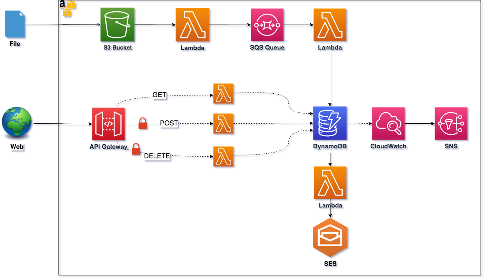

# serverless project

Personal project to play with serverless framework

## Documentation
https://www.serverless.com/framework/docs/  
https://aws.amazon.com/pt/serverless/

## Introduction
This repository was created to develop a modern application using an event-driven, serverless architecture on AWS. It will integrate several fully-managed services, all part of the AWS Serverless Computing platform, including Lambda, API Gateway, SQS, S3, DynamoDB, CloudWatch, SES and SNS. The result will be an application composed of small, easily deployable, loosely coupled, independently scalable, serverless components.

## What is Event-Driven?
It is an architectural pattern that can make services more reusable, interoperable, and scalable. All interactions between application components are as a direct result of triggering an event.

## What is Serverless?
According to AWS, “Serverless applications don’t require provisioning, maintaining, and administering servers for backend components such as compute, databases, storage, stream processing, message queueing, and more.” You pay for consistent throughput or execution duration rather than by server unit, and, at least on AWS, you don’t pay for idle resources. Remember, if you’re paying for it but not using it, it’s not serverless.

## The application
- This application extracts the content from files placed in **S3**, queues a message to **SQS**, and finally, writes to **DynamoDB**, using **Lambda** functions.  
- A RESTful API is exposed, via **API Gateway**, to perform CRUD-like operations.  
- Using **DynamoDB Streams**, after a data is placed to DynamoDB, a lambda function is triggered and an e-mail is sent using **SES**.  
- Finally, if the DynamoDB capacity is consumed, **CloudWatch** sends a notification to **SNS** and its subscribers are notified.

## Application Architecture
 

## Useful commands

Setup serverless framework
```
npm install -g serverless

serverless config credentials --provider aws --key <KEY> --secret <SECRET_KEY> --profile <PROFILE_ALIAS>
```

Create new project
```
serverless create --template aws-nodejs --path serveless-project
```

Deploy this application
```
npm install

sls deploy --email <EMAIL>

optional: --stage prod (dev is default)
```
>**< EMAIL> is the verified e-mail used to send the messages*


Deploy a single function
```
sls deploy -f <functionName>
```

Display information about the service
```
sls info -v
```
